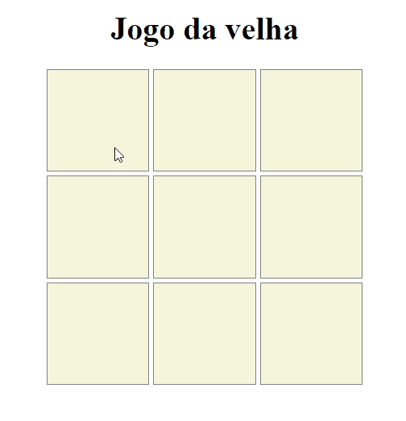

<h1 align="center">Jogo Da Velha</h1>

# Sobre 🚀

Achei muito interessante criar este projeto, pude utilizar meus conhecimentos em Array, cada carta teria sua posição no Array, a funcionalidade de ter 2 jogadores também foi com Array caso o jogador 1 tivesse feito a jogador passava a vez para o próximo jogador no caso o jogador 2, cada jogador tem seu emoji, trabalhei na criação de uma lógica onde se houvesse uma sequencia de cartas o jogador ganharia e não seria passado a vez para o próximo jogador e disparar um alert avisando que o jogo acabou e já tem um ganhador.

 
<h1>
    
</h1>

#### Tecnologias utilizadas 🚀
<ul>
    <li>HTML</li>
    <li>CSS</li>
    <li>JAVASCRIPT</li>
</ul>

Feito com ❤ por Brandon Carlos

